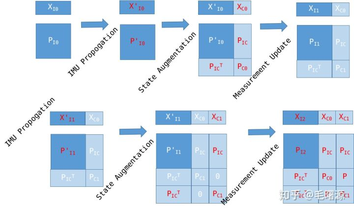

# 一

## [MSCKF相关学习资料](https://zhuanlan.zhihu.com/p/76341809)

## MSCKF核心思想
- 目标是解决EKF-SLAM的维数爆炸问题
- 传统EKF-SLAM将特征点加入到状态向量中与IMU状态一起估计，当环境很大时，特征点会非常多，状态向量维数会变得非常大。MSCKF不是将特征点加入到状态向量，而是**将不同时刻的相机位姿(位置p和姿态四元数q)加入到状态向量**，特征点会被多个相机看到，从而**在多个相机状态（Multi-State）之间形成几何约束（Constraint），进而利用几何约束构建观测模型对EKF进行update**。
- 由于相机位姿的个数会远小于特征点的个数，MSCKF状态向量的维度相较EKF-SLAM大大降低，历史的相机状态会不断移除，只维持固定个数的的相机位姿（Sliding Window），从而对MSCKF后端的计算量进行限定
- 
### 3.1 IMU状态向量与INS
- MSCKF本质上时一个EKF
- INS的EKF步骤为：
  - EKF预测：先利用传感器获得的观测加速度和观测角速度，可以对状态进行估计，显然，该步骤会使得估计的不确定度/协方差越来越大
  - EKF更新：然后利用GPS观测构建观测模型，对状态向量的均值和协方差进行更新, 修正预测过程的累积误差，减少不确定度。
### 3.2 MSCKF中的观测模型
- **EKF预测步骤与INS一样，区别在EKF观测更新，需要用视觉信息来构建观测模型，从而对IMU预测的状态进行更新。INS中GPS可以直接给出位置 p的观测，而视觉通常只能提供多个相机之间相对位姿关系的约束。**
- 用这个重投影误差的约束等式来作为观测模型，但前提是需要知道特征点的3D坐标，而实际应用中特征点的3D坐标是未知的。
  - EKF-SLAM的做法是将特征点加入到状态向量进行估计，但它的状态向量会随特征点的增多而变得非常大。
  - MSCKF的做法是根据历史相机位姿和观测来三角化计算特征点的3D坐标。这又带来了一个问题：如何确保三角化的精度呢？如果三角化误差太大，那么观测模型就会不准，最终会使得VIO精度太差。MSCKF做法是当特征点跟踪丢失后再进行三角化，特征点跟丢表示该特征的观测不会再继续增加了，这时利用所有的历史观测三角化。所以MSCKF中观测更新的时机是特征点跟丢。

## MSCKF算法步骤
1. IMU积分：先利用IMU加速度和角速度对状态向量中的IMU状态进行预测，一般会处理多帧IMU观测数据。
2. 相机状态扩增：每来一张图片后，计算当前相机状态并加入到状态向量中, 同时扩充状态协方差.
3. 特征点三角化：然后根据历史相机状态三角化估计3D特征点
4. 特征更新：再利用特征点对多个历史相机状态的约束，来更新状态向量。注意：这里不只修正历史相机状态，因为历史相机状态和IMU状态直接也存在关系(相机与IMU的外参)，所以也会同时修正IMU状态。
5. 历史相机状态移除：如果相机状态个数超过N，则剔除最老或最近的相机状态以及对应的协方差.

- MSCKF状态propagation和update的流程如下图所示:
- 
1. 首先初始化状态向量和协方差
2. 然后进行IMU积分，状态向量和协方差都发生改变
3. 接着将新的相机状态加入到状态向量中，扩充协方差矩阵（新相机自身的协方差以及对 Ximu的协方差）
4. 进行观测更新，所有状态和协方差都会发生改变。（注意：第一次因为只有一个相机状态，形成不了重投影约束，所以第一次观测更新并不会做任何事情）
5. 当相机状态个数超过限制时，删除最历史的一个相机状态及其对应的协方差项。
6. 重复2-5。

## 评论
- 前端后端只是一个叫法，没必要刻意区分。一般把特征跟踪叫做前端，EKF滤波器（IMU积分、特征更新等）叫做后端。
- MSCKF本质是做VO，内部没有存位姿节点，所以也不会做回环检测，但并不代表MSCKF不能加回环。MSCKF可以按一定的策略采样一些相机节点构建位姿图，相邻edge可以直接用Slidingwindows中的相机相对位姿，再检测闭环构建闭环edge，最后做位姿图优化。

- 纯旋转情况下没法三角化，相当于MSCKF的特征更新没法做，但是可以用IMU积分来做短时间的状态估计（长时间会发散）。VIO能处理纯旋转指的是VO在纯旋转失效时可以用IMU来估计旋转。